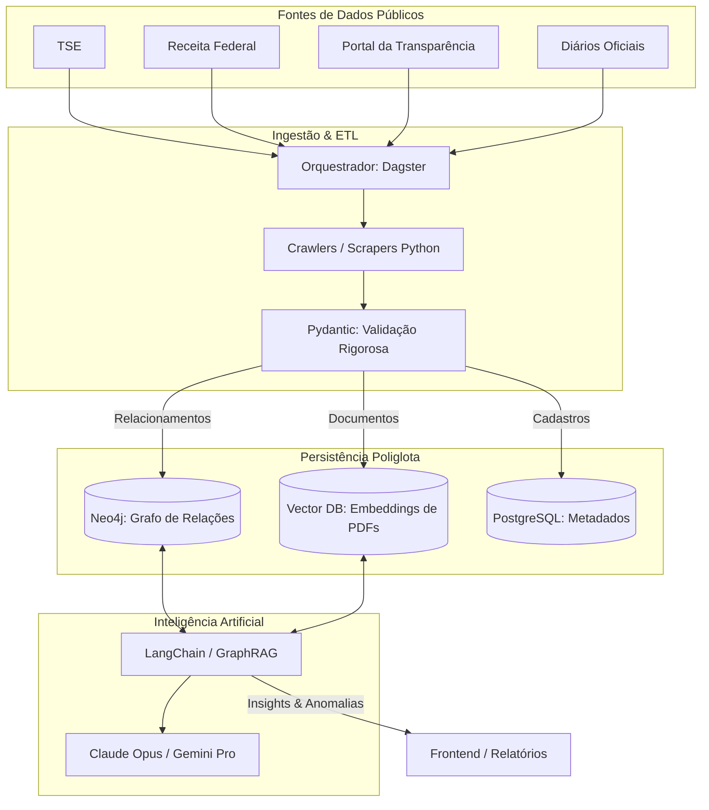

<div align="center">

# 🏛️ Projeto Orion Brasil

**Inteligência Artificial e Teoria dos Grafos aplicadas à Transparência Pública.**

[](#)
[](#)
[](#)
[](#)
[](#)
[](#license)

[Documentação Completa](#-visão-geral) · [Guia de Contribuição](CONTRIBUTING.md) · [Roadmap](#-roadmap) · [Aviso Legal](#️-aviso-legal--compliance)

</div>

---

## 📜 Manifesto Orion Brasil

A transparência pública no Brasil é, muitas vezes, uma ilusão de ótica. Ter dados disponíveis não significa ter dados acessíveis. Quando a informação é pulverizada em dezenas de portais, formatos obsoletos e sistemas que não conversam entre si, a burocracia deixa de ser uma falha técnica e passa a ser um escudo.

O **Orion Brasil** nasceu para quebrar esse escudo. Nós construímos tecnologia para trazer à tona o que se esconde no volume massivo de dados governamentais. 

No entanto, temos plena consciência do terreno em que estamos pisando. Entendemos a natureza estrutural da corrupção e como ela se defende. Como a cultura popular brasileira já diagnosticou com precisão cirúrgica:

> *"O sistema entrega a mão para salvar o braço. O sistema se reorganiza, articula novos interesses, cria novas lideranças. E custa caro. Muito caro. Não é à toa que entra governo, sai governo, a corrupção continua. O sistema é implacável."*

É exatamente porque o sistema se reorganiza que planilhas estáticas não funcionam. Nós precisamos de **Grafos** e **Inteligência Artificial** para mapear em tempo real essas novas lideranças, os novos interesses e o caminho do dinheiro.

### Nossos Princípios

**1. Anonimato Estratégico**
Este projeto foi criado, será mantido e administrado de forma anônima por seus idealizadores e principais mantenedores. Temos ciência absoluta dos riscos inerentes à investigação de autoridades e do poder político. O anonimato não é uma fuga, é uma garantia de que o projeto sobreviverá aos seus criadores. Sabemos que, à medida que a ferramenta ganhar tração, **leis e barreiras técnicas serão criadas para nos impedir**. O código aberto e descentralizado é a nossa resposta.

**2. Rigor Técnico e Justiça**
Apesar de lidarmos diretamente com o combate a desvios, o nosso código não é um tribunal. Perante a Constituição e a Justiça Brasileira, todos são inocentes até que se prove o contrário com o devido trânsito em julgado. Por isso, a plataforma **jamais** crava condenações. Nós utilizamos o termo *suspeito*, apontamos *anomalias matemáticas* e revelamos *conflitos de interesse*. O Orion Brasil fornece a inteligência de dados; o ônus da prova final e o julgamento pertencem às autoridades competentes e ao jornalismo investigativo.

**3. Tributo e Inspiração**
Nenhuma grande iniciativa nasce do vácuo. O projeto Orion Brasil foi profundamente inspirado no trabalho do brasileiro Bruno César — um profissional do qual temos imenso orgulho —, que desenvolveu uma iniciativa técnica brilhante com o mesmo espírito, mas que, por questões de segurança e força maior, ainda não pôde ser revelada ao público. Nós carregamos essa tocha adiante.

Nós não vamos mudar o país escrevendo textões na internet. Nós vamos mudar o país escrevendo código. **Junte-se a nós.**


---

## 👁️ Visão Geral

O **Projeto Orion Brasil** é uma plataforma open-source de investigação de dados governamentais. Nossa missão é mapear o invisível: cruzar mais de 80 bases de dados públicas brasileiras para expor conflitos de interesse, redes de empresas de fachada, emendas parlamentares direcionadas e evolução patrimonial anômala.

Onde planilhas falham por excesso de ruído, nós utilizamos **Bancos de Dados Orientados a Grafos** (para entender *quem conhece quem*) e **Modelos de Linguagem de Grande Escala (LLMs)** (para extrair contexto de contratos e diários oficiais).

---

## 🧠 Arquitetura do Sistema

Nossa arquitetura foi desenhada para ser resiliente a falhas de APIs governamentais e escalável para milhões de nós e arestas.



---

## ⚡ Principais Funcionalidades

- **🕷️ Ingestão Descentralizada:** Arquitetura de plugins isolados. Se o site do IBAMA mudar, apenas o módulo do IBAMA falha, sem derrubar a esteira principal.
- **🔗 Resolução de Entidades Cross-Database:** Algoritmos avançados para garantir que o "João" do TSE é o mesmo sócio-administrador na base da Receita Federal.
- **🕸️ GraphRAG (Retrieval-Augmented Generation):** A IA não alucina. Cada resposta ou suspeita apontada pelo Claude/Gemini vem acompanhada do caminho exato no grafo e do link oficial do documento gerador.
- **🚨 Detecção de Anomalias Estruturais:** Identificação automática de padrões como *"político → destina emenda → para prefeitura → que contrata → empresa da esposa do político"*.

---

## 🛠️ Stack Tecnológica

| Camada | Tecnologia | Propósito |
|---|---|---|
| **Ingestão / ETL** | Python, Dagster, Pydantic | Extração resiliente, orquestração de falhas e validação de contratos de dados. |
| **Banco de Dados** | Neo4j, PostgreSQL, Pinecone | Grafo para conexões, Relacional para usuários, Vetorial para busca semântica. |
| **IA & Inferência** | LangChain, Claude 3 Opus, Gemini | Extração de entidades (NER) de textos livres e análise investigativa. |
| **API / Backend** | FastAPI (Python) | Interface de comunicação rápida e assíncrona. |

---

## 📊 Status das Integrações (Bases de Dados)

Nossa meta é mapear **80+ fontes**. Veja o que já temos e onde precisamos de ajuda:

- [ ] **TSE:** Candidatos, Bens Declarados, Doadores de Campanha. *(Em desenvolvimento nesse momento)*
- [ ] **Receita Federal:** Quadro de Sócios e Administradores (QSA), CNPJs ativos e baixados. *(Em desenvolvimento nesse momento)*
- [ ] **Portal da Transparência:** Contratos, Licitações, Emendas Parlamentares. *(Buscando mantenedor)*
- [ ] **RAIS/Caged:** Vínculos empregatícios (para detecção de laranjas/fantasmas). *(Buscando mantenedor)*
- [ ] **IBAMA:** Multas ambientais. *(Buscando mantenedor)*

---

## 📋 Pré-requisitos

Antes de rodar o projeto, certifique-se de ter instalado:

| Requisito | Versão mínima | Observação |
|---|---|---|
| **Docker** | 24+ | Com Docker Compose v2 |
| **RAM disponível** | 8 GB | Neo4j + Vector DB consomem memória |
| **API Key** | — | Anthropic (Claude) **ou** Google (Gemini) |

---

## 🚀 Quickstart (Rodando Localmente)

Nós preparamos um ambiente "One-Click" utilizando Docker. Você não precisa instalar bancos de dados na sua máquina.

**1. Clone o repositório:**

```bash
git clone https://github.com/lucastelles1/Projeto-Orion-Brasil.git
cd Projeto-Orion-Brasil
```

**2. Configure as variáveis de ambiente:**

```bash
cp .env.example .env
# Adicione sua API Key do Anthropic/Google no arquivo .env
```

**3. Suba a infraestrutura completa:**

```bash
docker-compose up -d
```

**4. Acesse os painéis:**

| Serviço | URL |
|---|---|
| API Principal (Swagger) | `http://localhost:8000/docs` |
| Neo4j Browser (Grafos) | `http://localhost:7474` |
| Painel de Ingestão (Dagster) | `http://localhost:3000` |

---

## 🗺️ Roadmap

| Fase | Descrição | Status |
|---|---|---|
| **v0.1** | Ingestão TSE + Receita Federal | 🔄 Em progresso |
| **v0.2** | Motor GraphRAG + Neo4j | 🔄 Em progresso |
| **v0.3** | Portal da Transparência + Emendas | 📋 Planejado |
| **v0.4** | Frontend de Visualização de Grafos | 📋 Planejado |
| **v1.0** | Release público com documentação completa | 📋 Planejado |

---

## 🤝 Como Contribuir

O **Projeto Orion Brasil** só será possível com a força da comunidade de inteligência e engenharia de dados — seja escrevendo um scraper para um tribunal estadual, otimizando queries Cypher no Neo4j ou ajustando prompts de LLM.

👉 Leia o **[CONTRIBUTING.md](CONTRIBUTING.md)** para entender os padrões de código, testes obrigatórios e como abrir o seu primeiro Pull Request.

Ao participar deste projeto, você concorda com o nosso **[Código de Conduta](CODE_OF_CONDUCT.md)**.

---

## 🔒 Segurança

Se você descobrir uma vulnerabilidade de segurança, **não abra uma Issue pública**. Em vez disso:

1. Envie um e-mail para **lucastellessjp@gmail.com**.
2. Inclua uma descrição detalhada da vulnerabilidade e passos para reproduzi-la.
3. Daremos retorno o mais breve possível.

Agradecemos a divulgação responsável. Contribuidores que reportarem vulnerabilidades válidas serão reconhecidos no [Hall da Fama de Segurança](#) (caso autorizem).

---

## ⚖️ Aviso Legal & Compliance

- O **Projeto Orion Brasil** é estritamente uma ferramenta analítica matemática e tecnológica.
- Todos os dados processados são **públicos** e protegidos pela [Lei de Acesso à Informação (Lei nº 12.527/2011)](http://www.planalto.gov.br/ccivil_03/_ato2011-2014/2011/lei/l12527.htm).
- O sistema aponta anomalias, padrões e graus de separação. O output da IA **nunca** deve ser interpretado como acusação formal ou condenação.
- O ônus da investigação conclusiva pertence à Polícia Federal, Ministério Público, Tribunais de Contas e ao Jornalismo Investigativo Profissional.

---


## 📄 Licença

Este projeto está licenciado sob a [MIT License](LICENSE).

---

<div align="center">

**Feito com 🧠 e ☕ pela comunidade Projeto Orion Brasil.**

</div>
